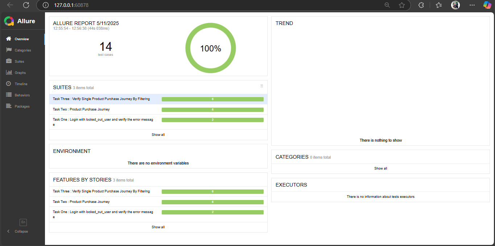
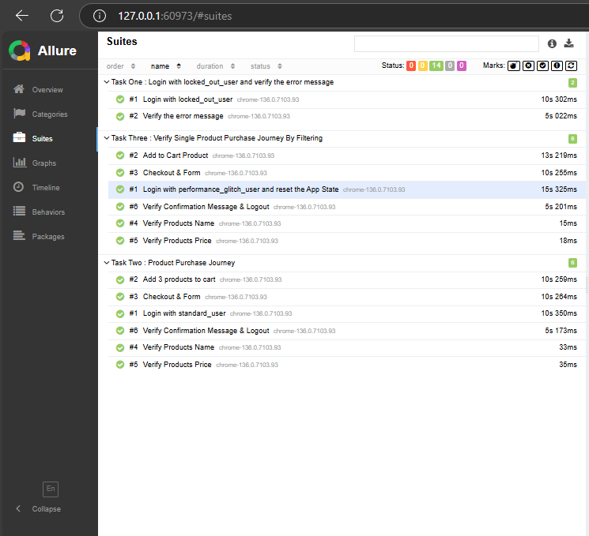

# 🧪 Swag Labs Ecommerce Website Webdriverio Test Automation.
This repository contains a test automation setup using **WebdriverIO** for the [Swag Labs](https://www.saucedemo.com/). There are 3 test scenarios and those will covers a user can login with their credentials, adding products into the cart and checkout. 

**Scenario Name**: First : Login with locked_out_user and verify the error message

1. Open [Swag Labs](https://www.saucedemo.com/)
2. Login with Username : locked_out_user & Password : secret_sauce
3. After getting an error. 
4. Verify the error with the expected result.

**Scenario Name**: Second : 3 Products Purchase Journey, Verify Products Name & Price

1. Open [Swag Labs](https://www.saucedemo.com/)
2. Login with Username : standard_user & Password : secret_sauce
3. After Login, reset the app state from humburger menu and select the 3 products and confirm the cart that products added successfully. 
4. From cart page, click on continue button to fill up the form with valid Name & Postal Code
5. Next in checkout page, Verify the products name and price are matched with the expected product's information.
6. By click on continue button, confirmation page will be visible. Verify with confirmation message, again reset the app state and logout. 

**Scenario Name**: Third : Verify 1 Product Purchase Journey By Filtering

1. Open [Swag Labs](https://www.saucedemo.com/)
2. Login with Username : performance_glitch_user & Password : secret_sauce
3. After Login, reset the app state from humburger menu and click on filter button and select the filter option [by name (Z to A)] 
4. Select 1 products and confirm the cart that product added successfully. 
5. From cart page, click on continue button to fill up the form with valid Name & Postal Code
5. Next in checkout page, Verify the products name and price are matched with the expected product's information.
6. By click on continue button, confirmation page will be visible. Verify with confirmation message, again reset the app state and logout. 

---

## ⚙️ Tech Stack

- [Node.js](https://nodejs.org/)
- [WebdriverIO](https://webdriver.io/)
- [Mocha](https://mochajs.org/) (default test framework)
- [Allure Reporter](https://webdriver.io/docs/allure-reporter/)

---

## 🚀 Setup Instructions

### Clone the Repository

```bash
git clone https://github.com/yourusername/evershop-wdio-test.git
cd evershop-wdio-test
npm install
npm init wdio@latest .

Choose:
Test runner: local
Framework: mocha
Reporter: spec
Services: chromedriver
Use TypeScript: No
Spec File: specs/search.spec.js 
``` 

> Running the Test
```
npm run wdio
By Suite : npm run assignment
``` 
  
## Allure report
Ensure Chrome is installed since chromedriver is used. <br>
For Allure Report ```npm run getResult ``` for enhanced reporting.

---

