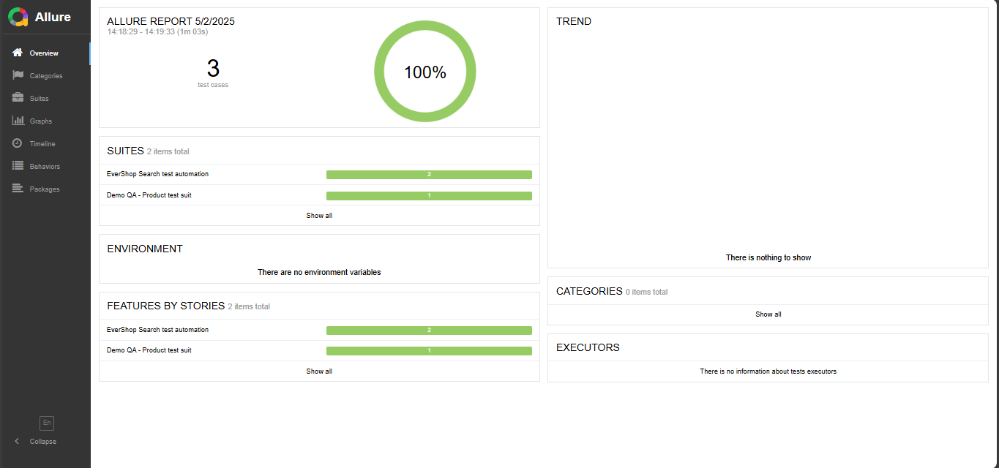

# 🧪 Evershop Webdriverio Test Automation
This repository contains a test automation setup using **WebdriverIO** for the [Evershop Demo Store](https://demo.evershop.io/). The test covers a user journey including searching for a product, selecting options, and adding to cart.

**Scenario Name**: Add Product to Cart

1. Open [https://demo.evershop.io](https://demo.evershop.io/)
2. Click the search icon in the header.
3. Search for **"Nike Air Zoom Pegasus 35"**.
4. Select the product from the search results or shop page.
5. On the product page:
   - Select **Size: L**
   - Select **Color: Black**
   - Set quantity to **2**
6. Click **Add to Cart**.
7. Confirm the product is added with the correct options and quantity.

---

## ⚙️ Tech Stack

- [Node.js](https://nodejs.org/)
- [WebdriverIO](https://webdriver.io/)
- [Mocha](https://mochajs.org/) (default test framework)
- [Allure Reporter](https://webdriver.io/docs/allure-reporter/)

---

## 🚀 Setup Instructions

### Clone the Repository

```bash
git clone https://github.com/yourusername/evershop-wdio-test.git
cd evershop-wdio-test
npm install
npm init wdio@latest .

Choose:
Test runner: local
Framework: mocha
Reporter: spec
Services: chromedriver
Use TypeScript: No
Spec File: specs/search.spec.js 
``` 

> Running the Test
```
npm run wdio
By Suite : npm run product
``` 

## Allure report
Ensure Chrome is installed since chromedriver is used. <br>
For Allure Report ```npm run getResult ``` for enhanced reporting.

---
